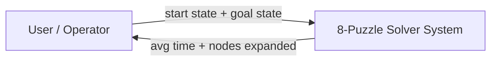
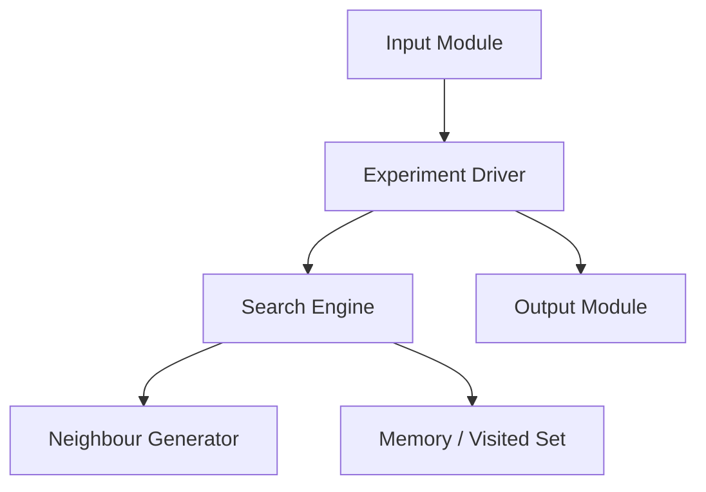
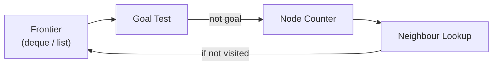

# SLE-3: Architectural Design (Full C4 Model)

### 8-Puzzle Solver using BFS and DFS

**Course:** 02AML204 – Introduction to Artificial Intelligence

| Field | Details |
| --- | --- |
| **Name** | Pranav Gajanan Revankar |
| **PRN** | 25UAM087 |
| **Division** | B |
| **Date** | 04 October 2026 |
| **GitHub** | [pranavrevankar33-ctrl](https://github.com/pranavrevankar33-ctrl) |

---

## 📌 1. System Title & Short Description

**System:** 8-Puzzle Solver using BFS and DFS — the same 8-puzzle search system that was profiled in **SLE-2**.

The system takes a fixed **start state** and **goal state** for a 3x3 sliding-tile puzzle and searches for the goal using two uninformed search algorithms:

- **Breadth-First Search (BFS)**
- **Depth-First Search (DFS)**

For every run it counts the **nodes expanded** and measures the **average execution time over 3 runs**. It solves the problem of comparing two search strategies fairly on the exact same puzzle, start state and move order.

**Project timeline:**

- **SLE-1** – built a rule-based chatbot agent
- **SLE-2** – measured this search code
- **SLE-3** – documents the architecture behind it (this repository)

---

## 🌍 2. Context Diagram (Level 1)

> *Fig. 1 — C4 Level 1: the 8-Puzzle Solver System and the world around it.*

The **User / Operator** gives the system a start state and a goal state and receives back the average execution time and the number of nodes expanded for each algorithm.

The system has **no external system, database or network dependency** — it only uses Python's standard library (`time`, `collections`), so no outside box is drawn besides the user.

---

## 📦 3. Container Diagram (Level 2)

> *Fig. 2 — C4 Level 2: the six main building blocks of the system.*

| Container | Description |
| --- | --- |
| **Input Module** | Holds the fixed `INITIAL_STATE` and `GOAL_STATE` tuples. |
| **Experiment Driver** | `run_experiments()`; calls each solver 3 times and times every run with `time.perf_counter`. |
| **Search Engine** | `solve_bfs()` or `solve_dfs()`; expands states and counts `nodes_expanded`. |
| **Neighbour Generator** | `get_neighbors()`; shared by both algorithms so the comparison stays fair. |
| **Memory / Visited Set** | The visited set inside each search that stops states being expanded twice. |
| **Output Module** | Prints the final average-time and nodes-expanded summary. |

---

## 🧩 4. Component Diagram (Level 3)

> *Fig. 3 — C4 Level 3: components inside the **Search Engine** container only.*

The Search Engine is the most important container, so only its internals are drawn.

1. The **Frontier** (a `deque` for BFS, a `list` for DFS) gives up the next state.
2. The **Goal Test** checks that state.
3. If it is not the goal, the **Node Counter** increments.
4. The **Neighbour Lookup** is called to get the next states.
5. Unvisited states are pushed back onto the Frontier.

The **Visited Set** itself lives in the Memory container, not inside Search Engine.

> **Note:** This implementation only counts nodes and does not reconstruct an actual move path, so no *Path Reconstructor* component is shown.

---

## 💻 5. Code Level Overview (Level 4)

| Name | Kind | Responsibility (container) |
| --- | --- | --- |
| `INITIAL_STATE` / `GOAL_STATE` | tuple | The fixed start and goal 8-puzzle states (Input Module). |
| `get_neighbors(state)` | function | Returns the valid Up/Down/Left/Right neighbour states of a given state (Neighbour Generator). |
| `solve_bfs(start, goal)` | function | Breadth-first search using a FIFO queue (`deque`); returns nodes expanded (Search Engine). |
| `solve_dfs(start, goal)` | function | Depth-first search using a LIFO stack (`list`); returns nodes expanded (Search Engine). |
| `run_experiments()` | function | Runs each algorithm 3 times, times it with `time.perf_counter`, and prints the results (Experiment Driver / Output Module). |

---

## 🧠 6. Design Decisions

- **Shared `get_neighbors()`** – written once and used by both `solve_bfs()` and `solve_dfs()`, so the two algorithms differ only in the Frontier's data structure (`deque` vs `list`). This keeps the SLE-2 comparison fair.
- **Visited set instead of full paths** – the puzzle's move graph has cycles (a move can be undone) and would loop forever without it.
- **Timing only in the Experiment Driver** – measuring the algorithms never changes the search logic itself.
- **No Heuristic Module** – BFS and DFS are both uninformed; an **A\*** version could later add one as a new component inside Search Engine.

---

## 🤖 7. AI Contribution Note

- **AI tools used:** Gemini and ChatGPT (SLE-1/SLE-2 code), and Claude.
- **What AI helped with:** suggested the C4 structure for this 8-puzzle system, drafted the four levels, produced the diagrams, and wrote the draft explanations from my SLE-1 and SLE-2 reports.
- **What I did myself:** chose BFS/DFS 8-puzzle as the system, reviewed every diagram and description against my own SLE-2 code (`bfs_dfs_8puzzle.py`), and checked that the container and function names match what I actually implemented.

---

## ✅ 8. Conclusion

C4 showed the same system at four levels of detail:

- **Context** – who uses it
- **Container** – its main parts
- **Component** – opens up the Search Engine
- **Code** – lists the functions that implement it

Drawing it made it clear that BFS and DFS share almost everything — the same neighbour logic and the same visited-set idea — and differ only in how the Frontier is handled, which is exactly why the SLE-2 results came out the way they did. A small, readable diagram with a few boxes explains a design better than a crowded one.

---

## 🛠️ Tech Stack

- **Language:** Python 3
- **Libraries:** Standard library only (`time`, `collections`)

## 👤 Author

**Pranav Gajanan Revankar** — PRN: 25UAM087 | Division B
GitHub: [@pranavrevankar33-ctrl](https://github.com/pranavrevankar33-ctrl)
